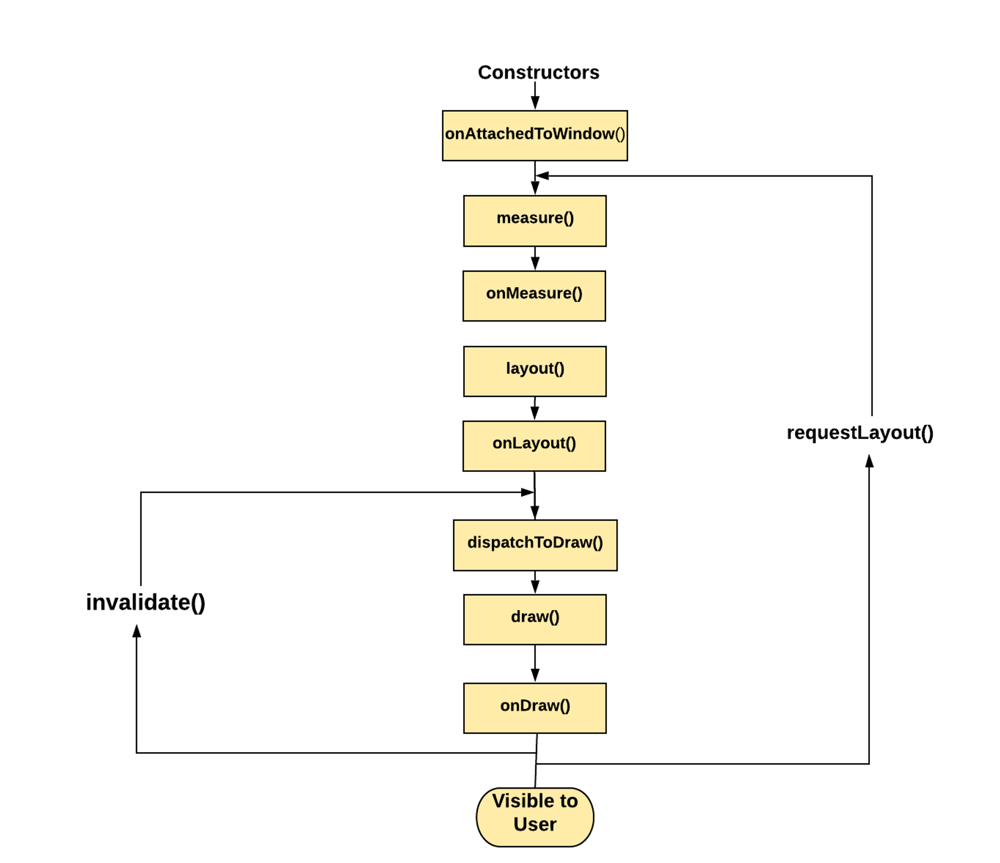
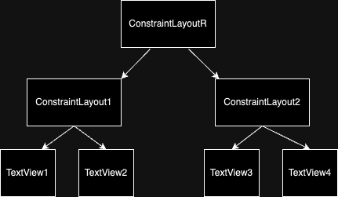

# Android가 View를 그리는 과정

### Android가 View를 그리는 방법

- Android 프레임워크는 Activity가 포커스를 받을 때 레이아웃을 그리도록 Activity에 요청
- Android 프레임워크는 View를 그리기 위한 절차를 처리하지만, Activity는 레이아웃 계층구조의 루트 노드를 제공해야 함.
- Android 프레임워크는 레이아웃 루트 노드를 그리고 레이아웃 트리를 측정한 후 그림.
    - 각 ViewGroup은 `draw()` 메서드를 통해 각 하위요소(View or ViewGroup)를 그림.
    - 레이아웃 트리는 전위 순회(DFS) 트리구조이기 때문에, 부모 뷰는 자식 뷰 보다 먼저 그려짐.

<aside>
💡 Android 프레임워크는 유효한 영역에 없는 View 객체를 그리지 않음.
invalidate() 메서드를 호출하여 View를 강제로 그릴 수 있음.

</aside>

### 두 가지 패스 프로세스



- Android 프레임워크는 `측정 패스`와 `레이아웃 패스`라는 두 패스로 레이아웃을 그림.

### Measure Pass(측정 패스)

- View의 크기를 측정하는 단계임.
    - 각 View는 재귀동안 치수 사양 트리를 아래로 전달함.
    - 측정 패스의 마지막 단계에는 모든 View가 측정치를 가지게됨.
        - 이 때 모든 View는 측정 값을 저장함.
- `measure()` 메서드로 View의 크기를 알아보기 위해 호출되고, 상위 항목은 너비와 높이 매개변수에 정보를 제공함.
- `measure()` 가 반환되면 측정된 값(MeasureSpec)과 모든 View객체의 하위 요소 값을 설정함.
    - 측정된 정보는 View객체의 상위 요소가 부여한 조건을 준수함.
- `measure()` 는 내부적으로 `onMeasure` 메서드를 호출하고 실제 크기 계산은 `onMeasure()` 메서드에서 실행됨.
- 측정 패스는 두 클래스를 사용해 치수를 정함.
    - `ViewGroup.LayoutParams` : View 객체가 어떻게 측정되고 배치되어 질지를 정함.
    - `Base ViewGroup.LayoutParam` : 뷰의 가로와 세로가 어떻게 커질지를 정함.
    - 치수는 3가지 종류가 있음.
        - 정확한 크기: dp, px
        - MATCH_PARENT : 부모 View 만큼 크기를 가짐.
        - WRAP_CONTENT : View 가 내용물을 감쌀 만큼의 크기를 가짐.(패딩 포함)

- 측정 패스를 정리하자면
  1. `measure` 단계에서 `ViewGroup.LayoutParams` 를 사용하여 View의 크기를 알아보고
  2. `MeasureSpec` 을 생성하여 `onMeasure`를 호출 후 
  3. `onMeasure` 에서 `MeasureSpec` 에 기반한 최종적은 View의 크기를 결정함.

### Layout Pass(레이아웃 패스)

- 측정 패스에서 계산된 크기를 사용하여 모든 하위요소를 배치함.
- `layout` 메서드로 호출이 시작되고, 이는 뷰의 최종적인 위치를 지정함.
    - `onLayout()` 은 뷰 그룹이 자식 뷰들을 어떻게 배치할 것인지를 결정하는 로직을 포함.
- `requestLayout()` 은 어떤 시점에서 뷰의 경계가 변경되었다면, View를 다시 측정하기 위해 이를 호출하여 Mesure, Layout 단계를 다시 거칠 수 있음.
    - 이 메소드는 통상 현재의 경계 내에서 적합하지 않은 경우 자신의 View 에 의해 불려짐.
    - View에서 메서드를 호출할 땐 항상 UI 스레드에서 수행해야함.

### 레이아웃 트리 그려지는 과정



- 다음과 같이 루트 레이아웃 트리가 있다고 가정하고, 측정, 레이아웃 그려지는 과정을 살펴보자.
    - 전위순회 방식으로 측정패스와 레이아웃 패스가 진행되고 그려짐

    ```kotlin
    D/TAG:  ConstraintLayoutR : onMeasure
    D/TAG:  ConstraintLayout1 : onMeasure
    D/TAG:  TextView1 : onMeasure
    D/TAG:  TextView2 : onMeasure
    D/TAG:  ConstraintLayout2 : onMeasure
    D/TAG:  TextView3 : onMeasure
    D/TAG:  TextView4 : onMeasure
    D/TAG:  ConstraintLayoutR : onMeasure
    D/TAG:  ConstraintLayout1 : onMeasure
    D/TAG:  TextView1 : onMeasure
    D/TAG:  TextView2 : onMeasure
    D/TAG:  ConstraintLayout2 : onMeasure
    D/TAG:  TextView3 : onMeasure
    D/TAG:  TextView4 : onMeasure
    D/TAG:  ConstraintLayoutR : onLayout
    D/TAG:  ConstraintLayout1 : onLayout
    D/TAG:  TextView1 : onLayout
    D/TAG:  TextView2 : onLayout
    D/TAG:  ConstraintLayout2 : onLayout
    D/TAG:  TextView3 : onLayout
    D/TAG:  TextView4 : onLayout
    D/TAG:  TextView1 : onDraw
    D/TAG:  TextView2 : onDraw
    D/TAG:  TextView3 : onDraw
    D/TAG:  TextView4 : onDraw
    ```

    - 두 번 이상 `measure()` 메서드를 호출 할 수 있는데, 이는 하위 요소의 제한되지 않은 크기의 합계가 너무 크거나 너무 작을 경우 상위 요소는 하위 요소의 크기를 제한하는 값으로 다시호출 할 수 있음.
    - 루트 레이아웃 부터 전위순회로 뷰, 뷰 그룹들이 그려지는걸 확인할 수 있음.

### 참고 사항

- `onMeasure()`, `onLayout()` 은 맞춤 측정이나 레이아웃 로직을 구현 할 때 재정의 해서 사용
    - ex) CustomView
- 루트 레이아웃 부터 모든 뷰, 뷰 그룹은 `onMeasure()` 를 실행한 후, 다시 루트 레이아웃 부터 `onLayout()` 을 수행함.
    - 이를 순회(Traversals)라고 함.
        - 부모에서 시작하여 마지막 노드까지 순회.
- `LayoutParams` 은 레이아웃에 대한 매개변수를 나타냄.
    - View가 부모 ViewGroup내에서 위치될 것인지와 크기는 어떠한지를 지정하는데 사용됨.
    - ViewGroup들은 자신만의 LayoutParams 하위 클래스를 가짐.
    - XML 레이아웃 파일에서 뷰를 정의할 때, LayoutParams는 `android:layout_width`와 `android:layout_height` 속성을 사용하여 지정됨.