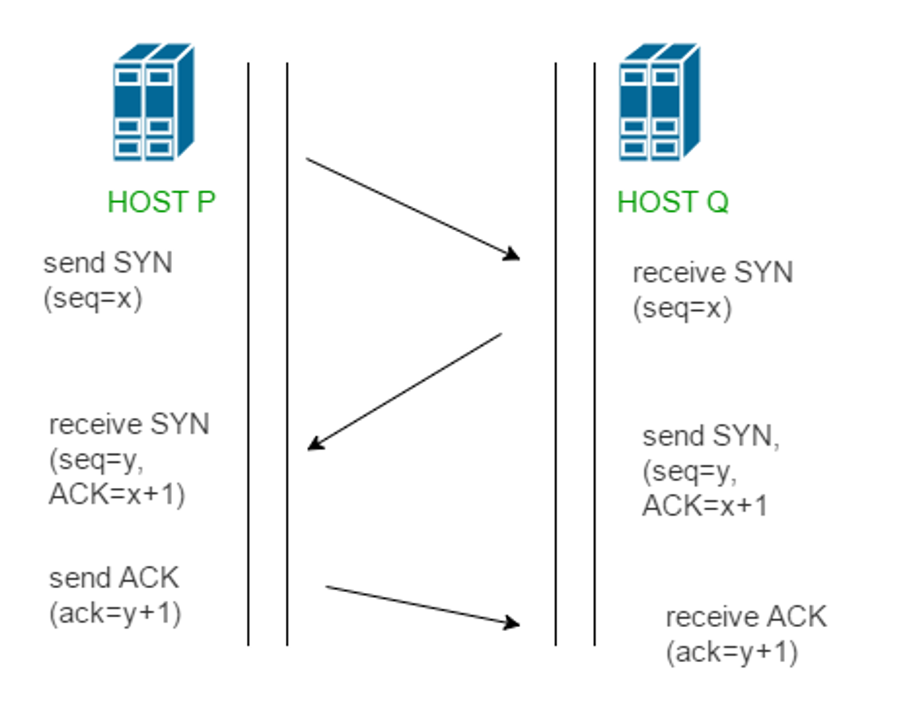
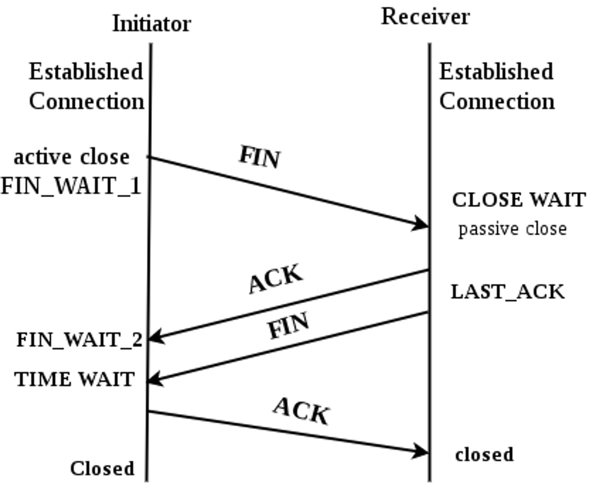

# 3 way handshake & 4 way handshake

### 3-way Handshake(TCP 연결 설정)

- TCP 연결 설정 프로세스임.
- 클라이언트와 서버 사이에 데이터 전송을 시작하기 전에 안정적인 연결을 확립하는데 사용.
    - TCP는 정확한 전송을 보장해야 함.

1. 클라이언트가 서버에 SYN 패킷을 보내 연결을 요청
    - SYN 패킷 : 연결 요청을 하는 패킷
        - 서버는 연결을 대기(수동적)하고 있으므로 SYN 패킷을 통해 클라이언트가 먼저 연결 요청을 보냄.
2. 서버가 SYN 패킷을 받고, 클라이언트로 받았다는 신호인 ACK와 설정된 SYN 패킷을 함께 전송함.
3. 클라이언트는 서버의 응답으로온 ACK와 SYN 패킷을 받고, ACK를 서버에 보내 연결을 확립함.

위 처럼 3번의 통신이 완료되면 연결이 성립되고, 클라이언트와 서버 사이에서 데이터 전송이 가능해짐.

### 4-way Handshake

- 연결 성립 후, 모든 통신이 끝났다면 해제해야 함.
- 즉, TCP 연결을 종료하기 위한 프로세스임.

1. 클라이언트는 서버에게 연결을 종료한다는 FIN 플래그를 보냄.
2. 서버는 FIN을 받고, 확인했다는 뜻으로 ACK을 클라이언트에게 보냄.
3. 서버도 연결이 종료되었다는 FIN을 클라이언트에게 보냄.
4. 클라이언트는 FIN을 받고, 확인했다는 ACK를 서버에게 보냄.

위 처럼 4번의 통신이 완료되면 연결이 해제됨.

### 공부하면서 궁금점

- 데이터의 전송이 끝나면 4-way handshake 프로세스가 진행되는데, 전송이 끝난걸 확인하는 방법
    - 프로토콜과 애플리케이션 마다 다름.
        - HTTP는 Request-Response 패턴이므로, 요청에 대한 응답이 왔다면 데이터의 전송이 완료된 것.
- 위 에서 더 궁금했던 부분이 5초마다 api call을 진행하는 Polling같은 기법엔 4-way handshake가 어떤 방식으로 진행되는지 궁금점이 생김.
    - api call을 할 때마다 3way-handshake, 4way-handshake가 계속 일어나는건 안좋다고 생각함.
    - 이는 `Persistent HTTP`로 어느정도 해결이 가능한 것 같음.
        - Persistent HTTP : 클라이언트가 여러 번 API를 호출하더라도 연결을 끊지 않고 유지함.
        - 다만, 너무 오랫동안 연결을 유지하면 다른 자원 문제가 발생할 수 있으므로, 적절한 시간동안만 유지하는 것이 좋음.