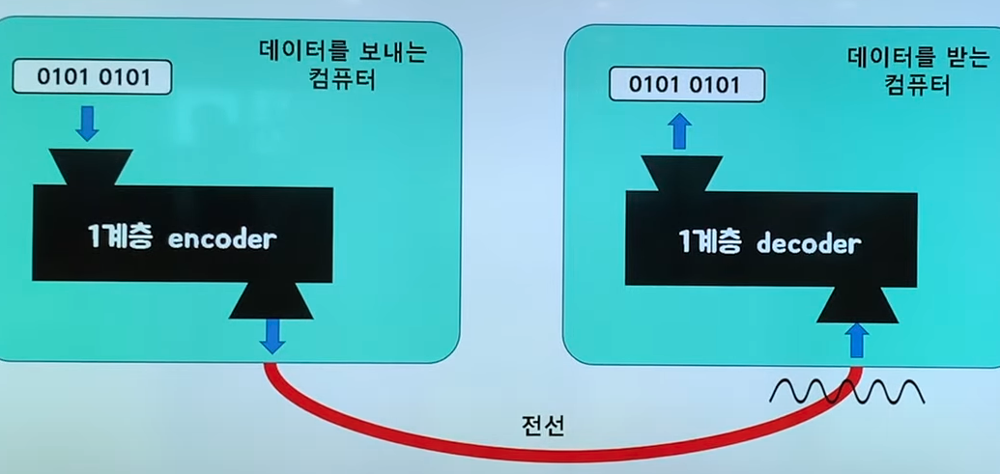
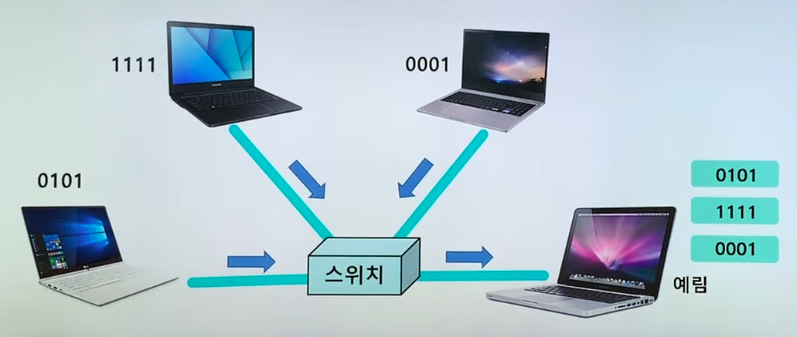
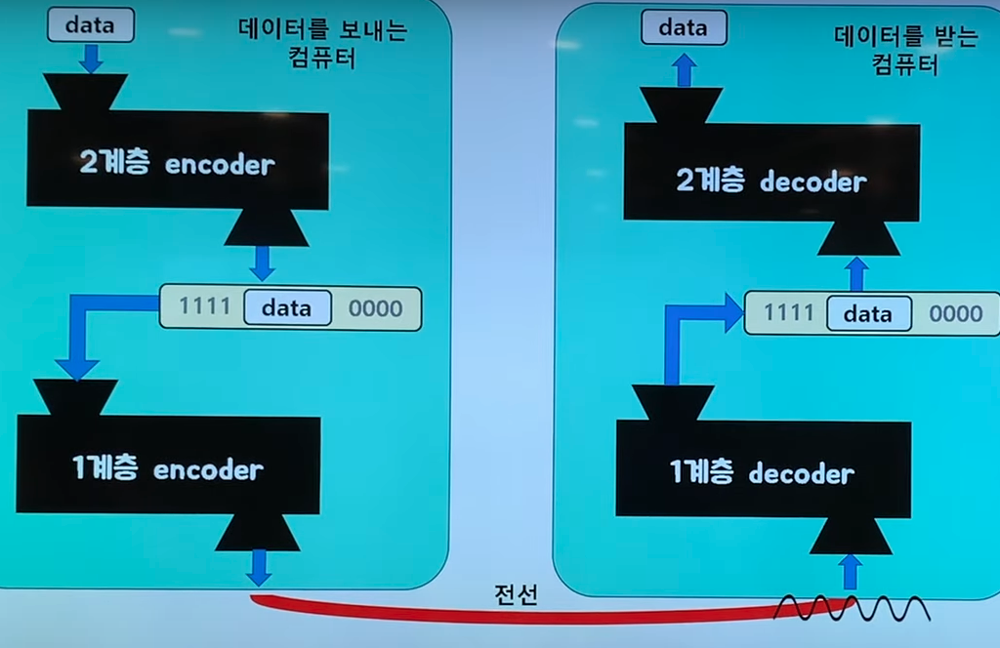
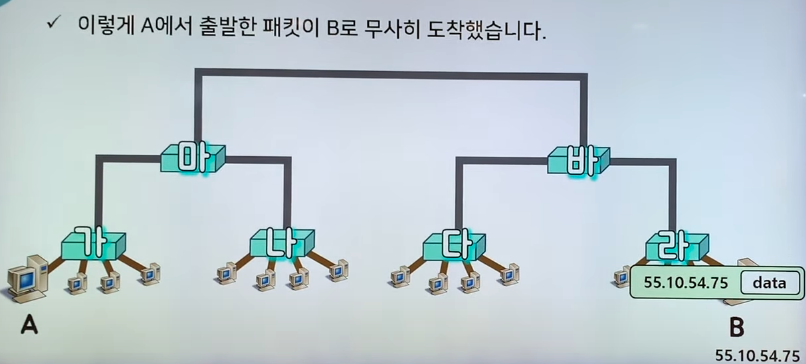
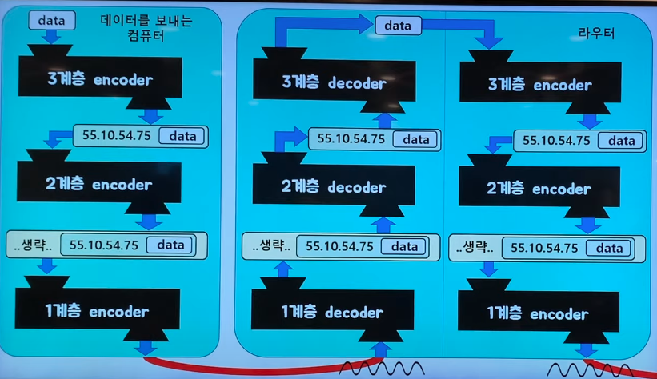
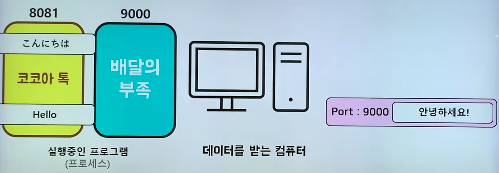
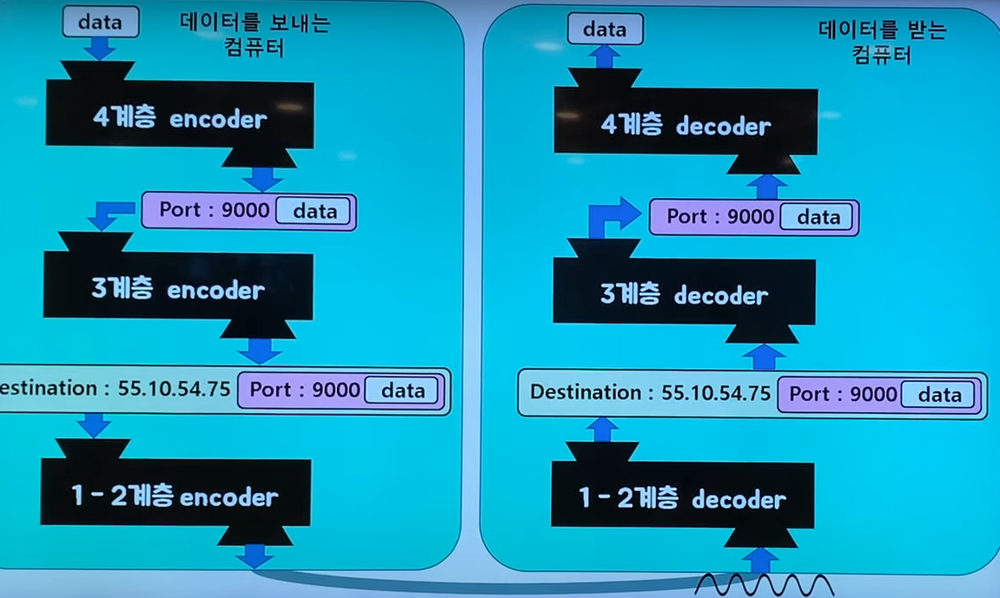
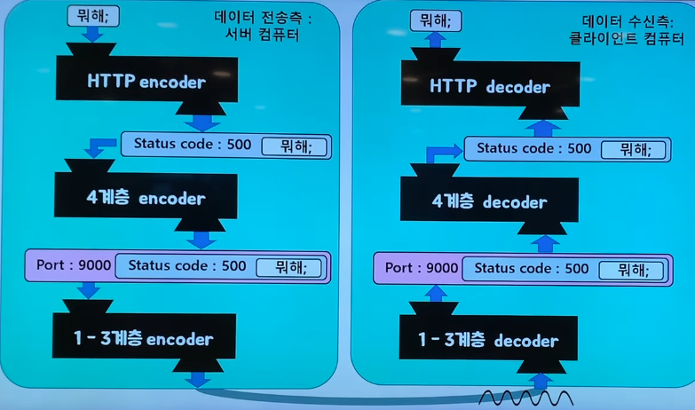

# OSI 7계층(OSI 7Layers), TCP/IP Updated 모델

- 네트워크 프로토콜들을 7개의 계층으로 분류한 네트워크 통신을 위한 표준 모델임.
- 통신이 일어나는 과정을 단계별로 알 수 있고, 각 계층 마다 역할과 책임이 있음.
    - 특정 계층에서 이상이 생기면 해당 계층만 수정하면 됨.
- 현대의 인터넷은 TCP/IP Updated 모델을 따르고 있음.

## 1계층 : Physical Layer(물리 계층)

- 0과 1의 나열을 아날로그 신호로 바꾸어 전선으로 흘려 보냄. → encoding
- 아날로그 신호가 들어오면 0과 1의 나열로 해석함. → decoding
- 즉, 물리적으로 연결된 두 대의 컴퓨터가 0과 1의 나열을 주고받을 수 있게 해주는 모듈(계층)임.
- 물리 계층은 하드웨어 적으로 구현되어 있음.
    - ex) 통신 케이블(랜선 등), 리피터, 허브, 모뎀 등
        - 물리 계층에 해당하는 장비고, 이를 통해서 신호를 주고 받음.

## 2계층 : Data-Link Layer(데이터 링크 계층)

- 1계층(물리 계층)에 속하는 기술론 여러 대의 컴퓨터가 통신하도록 만들 수 없음.
- 데이터 링크 계층은 같은 네트워크에 있는 여러 대의 컴퓨터들이 데이터를 주고받기 위해서 필요한 모듈(계층)임.
- Framing은 데이터 링크 계층에 속하는 작업들 중 하나임.
    - Framing이란 데이터 앞에 1111(시작), 0000(끝)과 같은 구분자를 넣어 원본 데이터를 감싼 것임.
        - 여러 대의 컴퓨터가 하나의 컴퓨터에 데이터를 전송할 경우 구분하기 위함임.
- 즉, 물리 계층으로 송수신되는 정보를 관리하여 안전하게 전달되도록 도와주는 역할임.
- 2계층 모듈(레이어)도 1계층 모듈처럼 하드웨어로 구성되어 있음.
    - LAN(Local Area Network)카드
        - 네트워크 안에서 컴퓨터간의 통신을 할 때 사용하는 장비라고함.
      

## 3계층 : Network Layer(네트워크 계층)

- 수 많은 네트워크들의 연결로 이뤄지는 인터넷 속에서 어딘가 있는 목적지 컴퓨터로 데이터를 전송하기 위해 필요한 모듈(계층)임.
- IP 주소를 이용해서 길을 찾고(routing), 자신 다음의 라우터에게 데이터를 넘겨주는 것(forwarding).
    - 라우터를 통해 이동할 경로를 선택하여 IP 주소를 지정하고, 해당 경로에 따라 패킷을 전달해줌.
- 위 그림에서 가 ~ 라는 라우터임.

## 4계층 Transport Layer(전송 계층)

- 포트(Port) 번호를 사용하여 도착지 컴퓨터의 최종 도착이진 프로세스까지 데이터가 도달하게 하는 모듈(레이어)임.
- TCP와 UDP 프로토콜을 통해 통신을 활성화함.

## 5계층 : Application Layer(응용 계층)

- 최종 목적지(End System)에 여러가지 서비스를 제공하거나, 받는 부분을 책임지는 모듈(계층)임.
    - ex) 이메일, 웹서핑 등
- 서비스를 제공하고, 받기 위해 어떤 형식으로 메시지를 주고 받아야하는지의 프로톨이 모여있음.
- Client - Server, Peer 2 Peer(P2P) 등 다양한 구조로 이루어져 있음.

# 관련 용어

- 맥 주소(MAC Address)
    - 네트워크 하드웨어를 고유하게 식별하기 위한 주소임.
    - 6Byte(48bit)의 길이로 되어있고, 보통 12자리의 16진수로 표현됨.
        - ex) AA:BB:CC:11:22:33
- 프레임(Frame)
    - 시작과 끝을 나타내는 플래그(0000, 1111), 송 수신자의 MAC주소, 데이터 등이 포함됨.
    - 물리 계층의 디코더로 부터 전송되고, 수신 측은 이 프레임을 분석하여 원래 데이터를 추출하고 어디로 전달되어야 하는지 결정함.
- 라우터
- 패킷
- 포트 번호